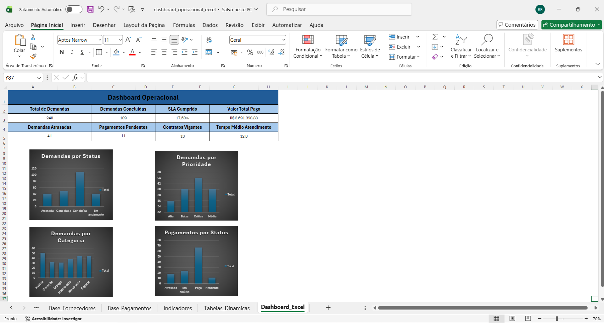
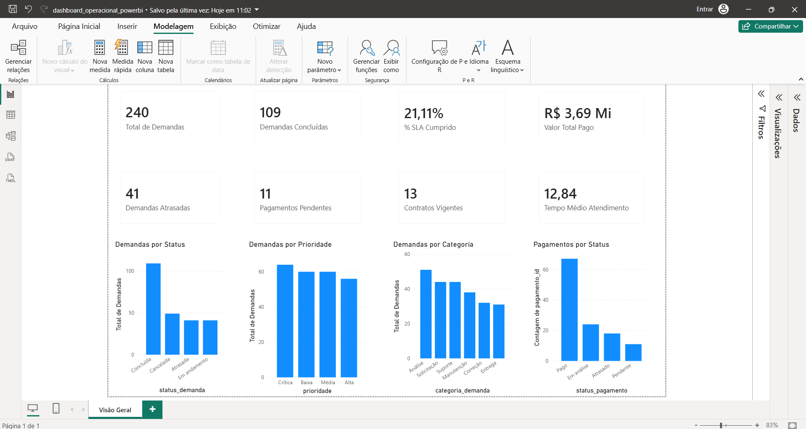

# BI Operational Dashboard

Projeto prático de Business Intelligence desenvolvido para análise operacional de demandas, contratos, fornecedores, pagamentos, SLA e indicadores.

O objetivo do projeto é demonstrar o uso de Excel e Power BI na organização, tratamento, análise e visualização de dados, simulando um cenário corporativo com indicadores para apoio à tomada de decisão.

---

## Objetivo do projeto

Construir uma solução simples e prática de BI operacional, contemplando:

- Criação de bases simuladas;
- Organização dos dados em arquivos CSV;
- Análise e dashboard em Excel;
- Dashboard executivo em Power BI;
- Criação de KPIs operacionais;
- Relacionamento entre tabelas;
- Medidas DAX;
- Documentação técnica;
- Evidências visuais do projeto.

---

## Ferramentas utilizadas

- Excel
- Power BI
- Power Query
- DAX
- CSV
- JavaScript
- Git
- GitHub
- Markdown
- VS Code

---

## Bases de dados utilizadas

As bases foram criadas de forma simulada para fins de estudo e portfólio.

Arquivos utilizados:

- `fornecedores.csv`
- `contratos.csv`
- `demandas.csv`
- `pagamentos.csv`

As informações simulam um cenário operacional envolvendo fornecedores, contratos, demandas internas e pagamentos.

---

## Estrutura do projeto

```text
bi-operational-dashboard/
│
├── data/
│   ├── raw/
│   │   ├── contratos.csv
│   │   ├── demandas.csv
│   │   ├── fornecedores.csv
│   │   └── pagamentos.csv
│   │
│   └── processed/
│
├── docs/
│   ├── dicionario/
│   │   └── dicionario-dados.md
│   │
│   └── evidencias/
│       ├── dashboard-operacional-excel.png
│       └── dashboard-operacional-powerbi.png
│
├── excel/
│   └── dashboard_operacional_excel.xlsx
│
├── powerbi/
│   └── dashboard_operacional_powerbi.pbix
│
├── scripts/
│   └── gerar_base_operacional.js
│
├── insights.md
├── README.md
└── .gitignore
```

---

## Indicadores analisados

O projeto contempla os seguintes indicadores:

- Total de demandas;
- Demandas concluídas;
- Demandas em andamento;
- Demandas atrasadas;
- Percentual de SLA cumprido;
- Tempo médio de atendimento;
- Total de pagamentos;
- Valor total pago;
- Pagamentos pendentes;
- Contratos vigentes;
- Demandas por status;
- Demandas por prioridade;
- Demandas por categoria;
- Pagamentos por status.

---

## Dashboard em Excel

Foi desenvolvido um dashboard operacional em Excel com:

- Importação das bases CSV;
- Tabelas estruturadas;
- Fórmulas para cálculo de indicadores;
- Tabelas dinâmicas;
- Gráficos;
- Cards de KPI;
- Visão consolidada dos dados operacionais.

### Evidência



---

## Dashboard em Power BI

Foi desenvolvido um dashboard executivo em Power BI com:

- Importação das bases CSV;
- Tratamento dos dados no Power Query;
- Relacionamento entre tabelas;
- Criação de tabela de medidas;
- Medidas DAX;
- Cards de KPI;
- Gráficos interativos;
- Visual executivo para análise operacional.

### Relacionamentos utilizados

- `fornecedores[fornecedor_id]` → `contratos[fornecedor_id]`
- `contratos[contrato_id]` → `demandas[contrato_id]`
- `contratos[contrato_id]` → `pagamentos[contrato_id]`

### Principais medidas DAX

```DAX
Total de Demandas = COUNTROWS(demandas)

Demandas Concluídas =
CALCULATE(
    COUNTROWS(demandas),
    demandas[status_demanda] = "Concluída"
)

Demandas Atrasadas =
CALCULATE(
    COUNTROWS(demandas),
    demandas[status_demanda] = "Atrasada"
)

Demandas em Andamento =
CALCULATE(
    COUNTROWS(demandas),
    demandas[status_demanda] = "Em andamento"
)

% SLA Cumprido =
DIVIDE(
    CALCULATE(
        COUNTROWS(demandas),
        demandas[sla_cumprido] = "Sim"
    ),
    CALCULATE(
        COUNTROWS(demandas),
        demandas[sla_cumprido] <> BLANK()
    )
)

Tempo Médio Atendimento =
AVERAGE(demandas[tempo_atendimento_dias])

Valor Total Pago =
SUM(pagamentos[valor_pago])

Total de Pagamentos =
COUNTROWS(pagamentos)

Pagamentos Pendentes =
CALCULATE(
    COUNTROWS(pagamentos),
    pagamentos[status_pagamento] = "Pendente"
)

Contratos Vigentes =
CALCULATE(
    COUNTROWS(contratos),
    contratos[status_contrato] = "Vigente"
)
```

### Evidência



---

## Principais resultados

Com base nos dados simulados, foram identificados os seguintes indicadores:

- Total de demandas: 240;
- Demandas concluídas: 109;
- Demandas em andamento: 41;
- Demandas atrasadas: 41;
- SLA cumprido: 21,11%;
- Valor total pago: R$ 3,69 Mi;
- Pagamentos pendentes: 11;
- Contratos vigentes: 13.

---

## Insights gerados

A análise dos dados permitiu observar pontos importantes sobre a operação simulada:

- As demandas concluídas representam o maior volume entre os status analisados;
- Existe um volume relevante de demandas atrasadas, indicando necessidade de acompanhamento dos prazos;
- O indicador de SLA aponta oportunidade de melhoria no controle e atendimento das demandas;
- Pagamentos pendentes devem ser acompanhados para evitar riscos administrativos e financeiros;
- A análise por categoria e prioridade ajuda a identificar concentrações de demandas e possíveis gargalos;
- A visão integrada entre contratos, fornecedores, demandas e pagamentos permite melhor controle operacional.

Os insights detalhados estão documentados no arquivo:

- [`insights.md`](insights.md)

---

## Aprendizados demonstrados

Este projeto demonstra conhecimentos práticos em:

- Análise de dados operacionais;
- Construção de indicadores;
- Excel aplicado a BI;
- Power BI;
- Power Query;
- Modelagem de dados;
- Relacionamentos entre tabelas;
- Medidas DAX;
- Criação de dashboards;
- Documentação técnica;
- Organização de evidências;
- Versionamento com Git e GitHub.

---

## Dicionário de dados

O dicionário de dados do projeto está disponível em:

- [`docs/dicionario/dicionario-dados.md`](docs/dicionario/dicionario-dados.md)

Ele descreve as principais tabelas, campos e informações utilizadas nas bases simuladas.

---

## Observação

Todas as informações utilizadas neste projeto são fictícias e foram criadas exclusivamente para fins de estudo, prática e composição de portfólio.